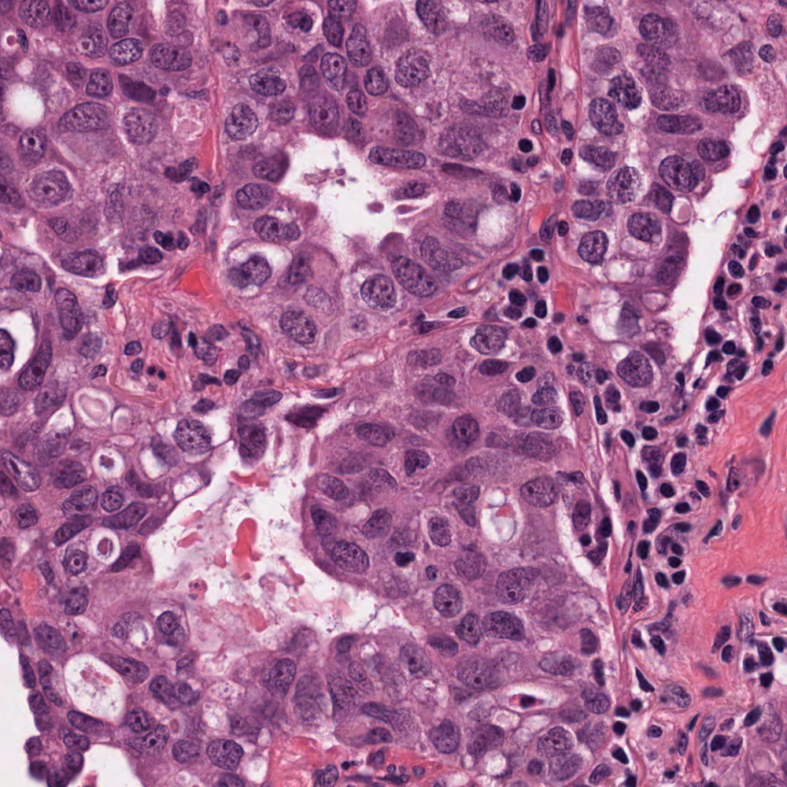
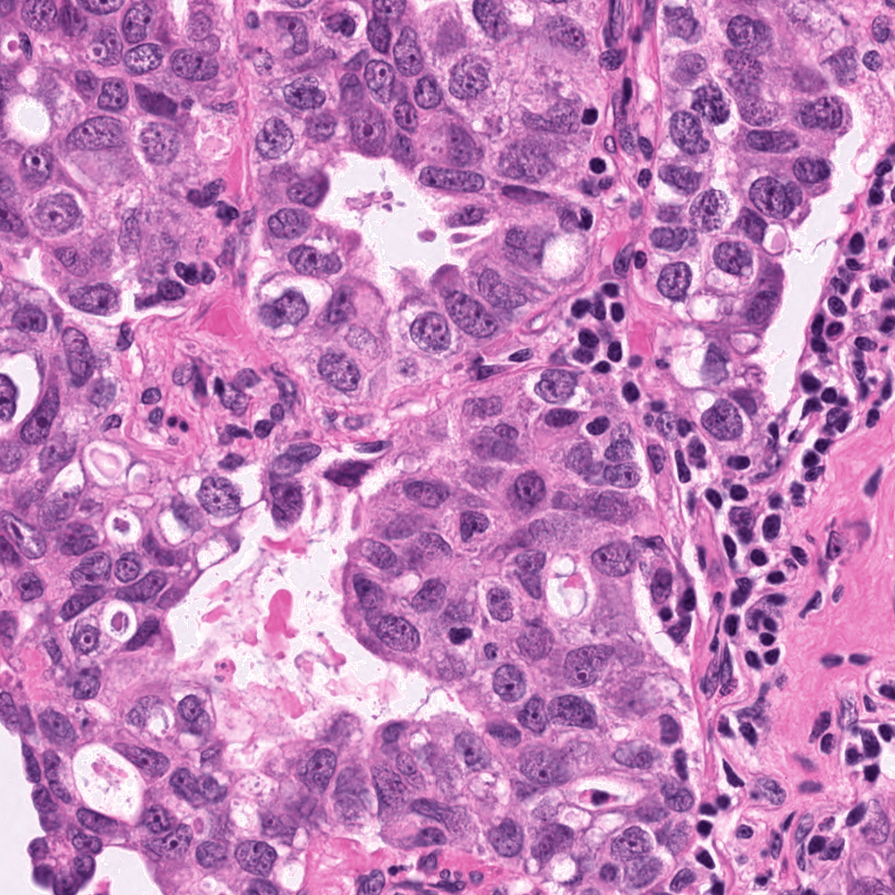
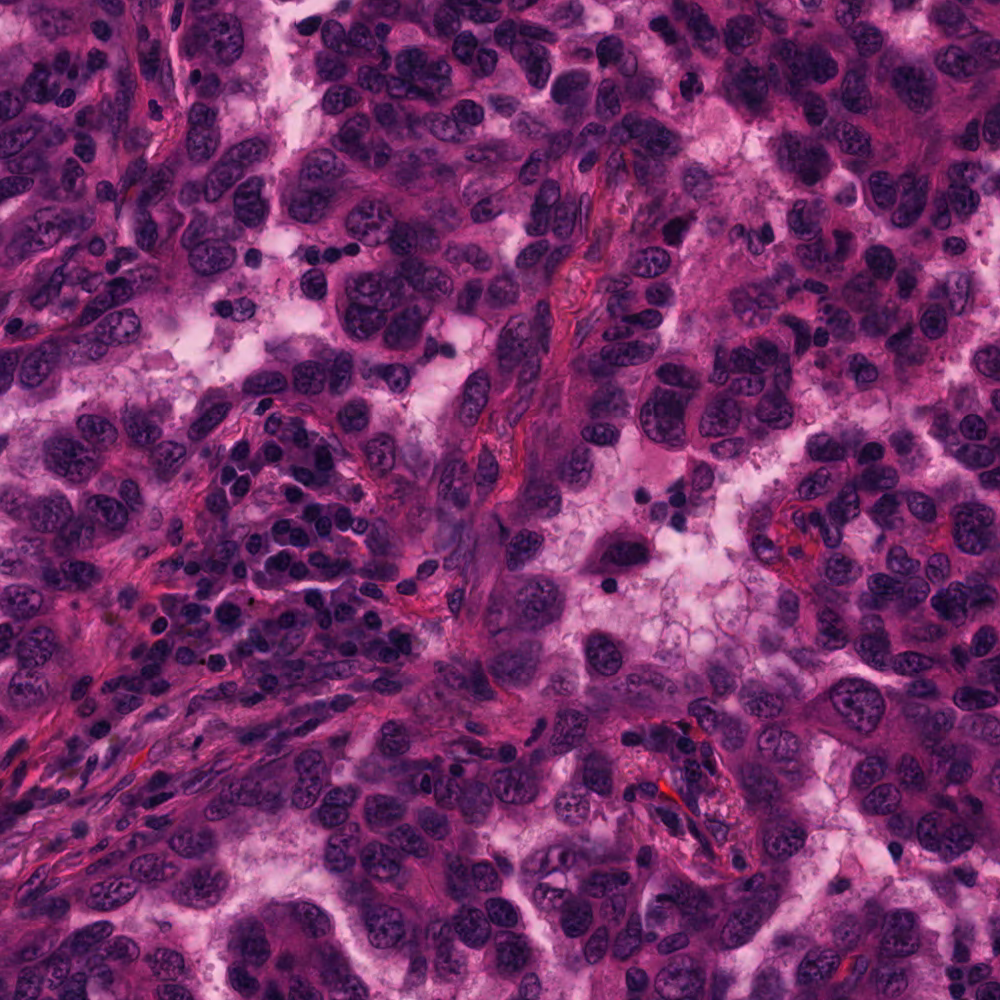
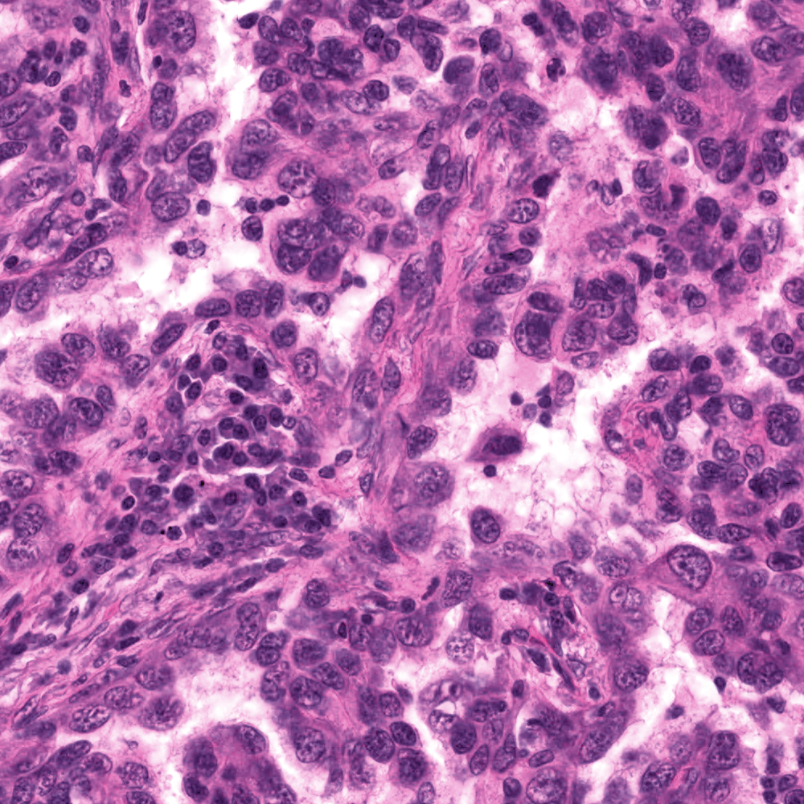
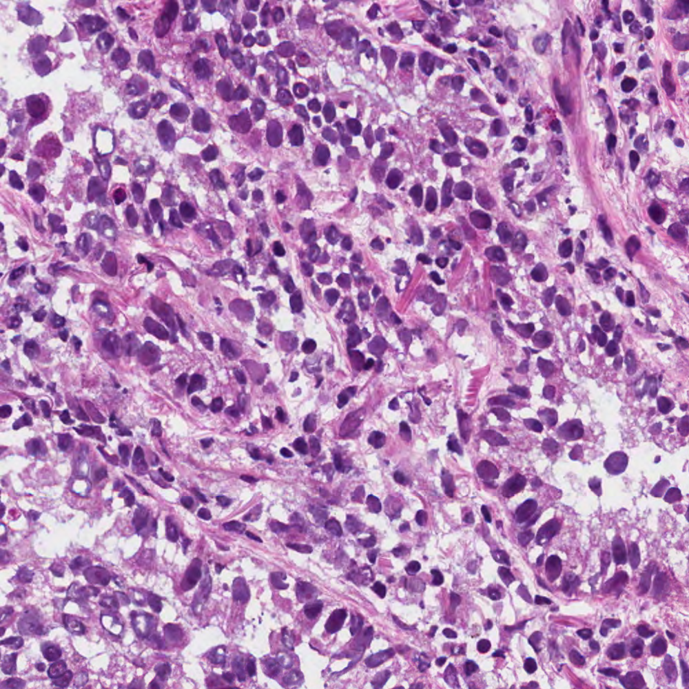
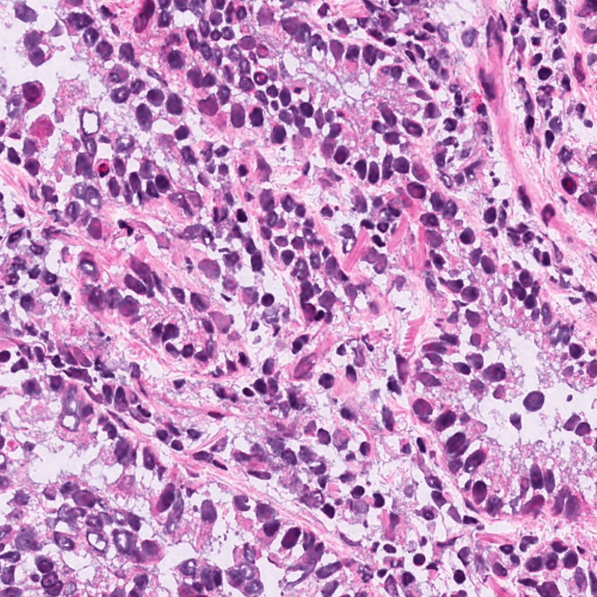

# TorchVahadane (tile workflow fork)

GPU-accelerated [Vahadane](https://ieeexplore.ieee.org/document/7460968) stain normalization for H&E tiles, with practical additions for batch tile pipelines: tissue-only brightness standardization, optional black-artifact and RBC handling, and optional slide-level stain matrices from whole-slide images (WSIs).

This repository is an [Enfield Lab](https://github.com/EnfieldLab) fork of [cwlkr/torchvahadane](https://github.com/cwlkr/torchvahadane). The original library documentation (API usage, histogram matching, WSI median stain estimation, installation, benchmarks) is preserved in **[torchvahadane.md](torchvahadane.md)**.

Our development and testing were done on a Windows 11 PC with Windows Subsystem for Linux ([WSL](https://learn.microsoft.com/en-us/windows/wsl/install)).

## What this fork adds


| Component                                        | Role                                                |
| ------------------------------------------------ | --------------------------------------------------- |
| `normalize_tiles.py`                             | Batch-normalize H&E tiles against a reference image |
| `helper_scripts/extract_wsi_features.py`         | Estimate per-slide stain matrices from WSIs(`.svs`) |
| `helper_scripts/npy_to_json.py`                  | Convert WSI feature `.npy` files to JSON            |
| `helper_scripts/convert_images_to_tiff.py`       | Batch-convert PNG/JPG to TIFF                       |
| `helper_scripts/check_luminosity.py`             | QC: mean LAB L per TIFF                             |
| `helper_scripts/extract_blob_nuclei_features.py` | Calibrate black-artifact thresholds                 |
| `helper_scripts/extract_rbc_regular_features.py` | Calibrate RBC thresholds                            |


## Pipeline overview

```text
                    ┌─────────────────────────────┐
  WSI files  ──────►│ extract_wsi_features.py     │──► wsi_features/<id>_stain_matrix.npy
                    └─────────────────────────────┘              │
                                                                 ▼
  raw tiles  ──────►│ normalize_tiles.py          │──► normalized tiles
  ref_image/ ──────►│  (+ optional wsi_features/) │
                    └─────────────────────────────┘
```

1. **(Optional)** Estimate a robust stain matrix per slide from the WSI.
2. Place a **reference** H&E image in `ref_image/` (target stain style). You can replace it with your own.
3. Run `normalize_tiles.py` on a folder of tiles.

For each tile, the normalizer:

1. Applies **tissue-only brightness standardization** (LAB L; blank/black left unchanged).
2. Fits Vahadane to the reference (`fit`) to get the **target** stain style.
3. Uses a **source** stain matrix from:
  - matching `wsi_features/<wsi_id>_stain_matrix.npy` (tile name prefix match), or
  - **per-tile estimation** if no WSI matrix is available.
4. Optionally treats **black artifacts** and **RBCs** as special: excluded from maxC scaling and copied from the original RGB in the output.


## Requirements

- Python environment with this package installed (see below, or [Installation](torchvahadane.md#installation) in the upstream docs).
- Recommended: CUDA for speed; `spams` for the faster CPU/staintools-style stain matrix path (falls back to GPU extraction if missing).
- For WSI feature extraction: **OpenSlide**.

Defaults (override with CLI):


| Path               | Default             |
| ------------------ | ------------------- |
| Reference image    | `ref_image/`        |
| Input tiles        | `original_tiles/`   |
| Output             | `normalized_tiles/` |
| WSI stain matrices | `wsi_features/`     |


Tile filenames should start with the slide ID when using WSI features (e.g. `JN_TS_013_bg_tile_....tiff` → `JN_TS_013_stain_matrix.npy`).

---


## Installation (requires Conda/Miniconda)

These steps recreate the development environment used for this fork (`torchvahadane`: **Python 3.11.3**, packages pinned in [requirements.txt](requirements.txt)).

```bash
# 1. Create and activate the env (same Python as the reference env)
conda create -n torchvahadane python=3.11.3
conda activate torchvahadane

# 2. OpenSlide C library (needed by openslide-python for WSI I/O)
#    Optional: also install openslide-python from conda-forge
#    conda install -c conda-forge openslide=4.0.0 openslide-python=1.4.3
conda install -c conda-forge openslide=4.0.0

# 3. Pinned Python dependencies (torch from the CUDA 12.8 index → nvidia-*-cu12 stack)
pip install -r requirements.txt --extra-index-url https://download.pytorch.org/whl/cu128

# If installation of spams fails, please try:
pip install spams-bin

# 4. Install this package
pip install .
```

If you installed `openslide-python` via conda in step 2, pip may report it as already satisfied in step 3.

Confirm the torch build:

```bash
python -c "import torch; print(torch.__version__, torch.version.cuda)"
# expected CUDA installs: 2.10.0 / 12.8 (plus nvidia-*-cu12 packages)
```

Verify GPU access after install:

```bash
python -c "import torch; print(torch.cuda.is_available(), torch.cuda.get_device_name(0) if torch.cuda.is_available() else 'no cuda')"
```

---


## Use cases


### 1. Normalize tiles (typical)

```bash
# Optional: estimate slide-level stain matrices first
python helper_scripts/extract_wsi_features.py \
  --wsi_dir /path/to/wsis \
  --output_dir wsi_features \
  --device cuda

# Normalize tiles (reference in ref_image/)
python normalize_tiles.py \
  --input /path/to/tiles \
  --output /path/to/normalized_tiles \
  --ref-dir ref_image \
  --wsi-features wsi_features
```

Or edit paths in `run_normalize_tiles.sh` and run:

```bash
bash run_normalize_tiles.sh
```


### 2. Normalize without WSI features

If `wsi_features/` is missing or a tile has no matching `*_stain_matrix.npy`, the script estimates the stain matrix **from that tile**.

By default, per-tile estimation excludes blank/black (LAB tissue mask) **and** black-artifact / RBC pixels from dictionary learning (same detectors used for maxC). Disable those exclusions if needed:

```bash
python normalize_tiles.py \
  --input /path/to/tiles \
  --output /path/to/out \
  --disable-stain-est-artifact-exclusion \
  --disable-stain-est-rbc-exclusion
```


### 3. Turn off artifact / RBC handling

Two layers are independent:


| Concern                                   | Flags (both ON by default)                                                    |
| ----------------------------------------- | ----------------------------------------------------------------------------- |
| Exclude from maxC + preserve original RGB | `--disable-black-artifact-filter`, `--disable-rbc-filter`                     |
| Exclude from per-tile stain-matrix fit    | `--disable-stain-est-artifact-exclusion`, `--disable-stain-est-rbc-exclusion` |


For a consistent “RBC off” / “artifact off”:

```bash
python normalize_tiles.py \
  --input /path/to/tiles \
  --output /path/to/out \
  --disable-rbc-filter \
  --disable-stain-est-rbc-exclusion \
  --disable-black-artifact-filter \
  --disable-stain-est-artifact-exclusion
```

Useful RBC tuning knobs (defaults shown):

```bash
python normalize_tiles.py \
  --input /path/to/tiles \
  --output /path/to/out \
  --rbc-dark-threshold 100 \
  --rbc-chroma-safeguard 55
```


### 4. Extract WSI stain features

```bash
python helper_scripts/extract_wsi_features.py \
  --wsi_dir /path/to/wsis \
  --output_dir wsi_features \
  --device cuda \
  --tile_size 4096 \
  --max_tiles 80
```

Writes per slide:

- `<stem>_stain_matrix.npy` — used by `normalize_tiles.py`
- `<stem>_maxCRef.npy` — saved for inspection / downstream use

Inspect as JSON:

```bash
python helper_scripts/npy_to_json.py \
  --input_dir wsi_features \
  --output_dir wsi_features_json
```


### 5. Convert images to TIFF

```bash
python helper_scripts/convert_images_to_tiff.py --dir /path/to/images
# or: bash run_convert_to_tiff.sh
```

Optional: `--remove-source`, `--skip-existing` / `--no-skip-existing`.

### 6. Calibrate filter thresholds

Collect small crop folders (artifacts vs dark nuclei; RBCs vs regular tissue), then:

```bash
python helper_scripts/extract_blob_nuclei_features.py \
  --artifacts_dir /path/to/artifacts \
  --nuclei_dir /path/to/nuclei_dark \
  --output blob_nuclei_features.json

python helper_scripts/extract_rbc_regular_features.py \
  --rbc_dir /path/to/rbc \
  --regular_dir /path/to/regular \
  --output rbc_regular_features.json
```

Use the resulting stats to tune black-artifact / RBC thresholds in `normalize_tiles.py`.

### 7. Quick luminosity QC

```bash
# Edit INPUT_DIR inside the script, then:
python helper_scripts/check_luminosity.py
```

Prints mean LAB L per TIFF and a folder average.

---


## `normalize_tiles.py` quick reference


| Flag                                     | Default / notes                                                                                                                                    |
| ---------------------------------------- | -------------------------------------------------------------------------------------------------------------------------------------------------- |
| `--input`                                | Input tile directory                                                                                                                               |
| `--output`                               | Output directory                                                                                                                                   |
| `--ref-dir`                              | Directory containing the reference image                                                                                                           |
| `--wsi-features`                         | Directory with `*_stain_matrix.npy`                                                                                                                |
| `--disable-black-artifact-filter`        | Off maxC exclusion + RGB preserve for artifacts                                                                                                    |
| `--disable-rbc-filter`                   | Off maxC exclusion + RGB preserve for RBCs                                                                                                         |
| `--disable-stain-est-artifact-exclusion` | Include artifacts when fitting per-tile stain matrix                                                                                               |
| `--disable-stain-est-rbc-exclusion`      | Include RBCs when fitting per-tile stain matrix                                                                                                    |
| Black-artifact knobs                     | `--grayscale-dark-threshold`, `--chroma-artifact-threshold`, `--v-artifact-threshold`, `--rgb-std-artifact-threshold`, `--black-artifact-max-area` |
| RBC knobs                                | `--r-g-ratio-threshold`, `--r-b-ratio-threshold`, `--r-dominance-threshold`, `--rbc-dark-threshold`, `--rbc-chroma-safeguard`                      |


Run `python normalize_tiles.py -h` for full help.

---


## Library API (upstream)

The core `TorchVahadaneNormalizer` API is unchanged. For drop-in usage, histogram matching, fixed stain matrices, installation, and benchmarks, see **[torchvahadane.md](torchvahadane.md)**.

```python
from torchvahadane import TorchVahadaneNormalizer

normalizer = TorchVahadaneNormalizer(device="cuda", staintools_estimate=True)
normalizer.fit(target)
img_normed = normalizer.transform(img)
```


## Example images

`example_images/` contains paired H&E tiles for visual comparison of stain color normalization (SCN):

| Filename pattern | Meaning |
|------------------|---------|
| `*.tiff` / `*.png` (no `_scn` suffix) | Original tile |
| `*_scn.tiff` / `*_scn.png` | Same tile after stain color normalization |

PNG previews are shown below (side by side). Matching TIFF files are also included in `example_images/`.

### `TCGA-38-6178-01Z-00-DX1`

<table>
  <tr>
    <td align="center"><b>Original</b><br/>
      
    </td>
    <td align="center"><b>Stain color normalized</b><br/>
      
    </td>
  </tr>
</table>

### `TCGA-49-4488-01Z-00-DX1`

<table>
  <tr>
    <td align="center"><b>Original</b><br/>
      
    </td>
    <td align="center"><b>Stain color normalized</b><br/>
      
    </td>
  </tr>
</table>

### `TCGA-69-7764-01A-01-TS1`

<table>
  <tr>
    <td align="center"><b>Original</b><br/>
      
    </td>
    <td align="center"><b>Stain color normalized</b><br/>
      
    </td>
  </tr>
</table>

These tiles are from the open [The Cancer Genome Atlas (TCGA)](https://www.genome.gov/Funded-Programs-Projects/Cancer-Genome-Atlas) dataset.

## Acknowledgments

Upstream TorchVahadane and its dependencies are credited in [torchvahadane.md](torchvahadane.md#acknowledgments) ([StainTools](https://github.com/Peter554/StainTools), [pytorch-lasso](https://github.com/rfeinman/pytorch-lasso), [torchstain](https://github.com/EIDOSLAB/torchstain)).

The default stain-normalization reference image (`ref_image/ref_image_JN_TS_022.tiff`) was provided by Consultant Pathologist Dr. Julia Naso, MD/PhD (Vancouver General Hospital | University of British Columbia).

Example tiles in `example_images/` are from [TCGA](https://www.genome.gov/Funded-Programs-Projects/Cancer-Genome-Atlas).

## License

This project is released under the [MIT License](LICENSE). It is an [Enfield Lab](https://github.com/EnfieldLab) fork of [TorchVahadane](https://github.com/cwlkr/torchvahadane) (also MIT); see `LICENSE` for copyright notices.
